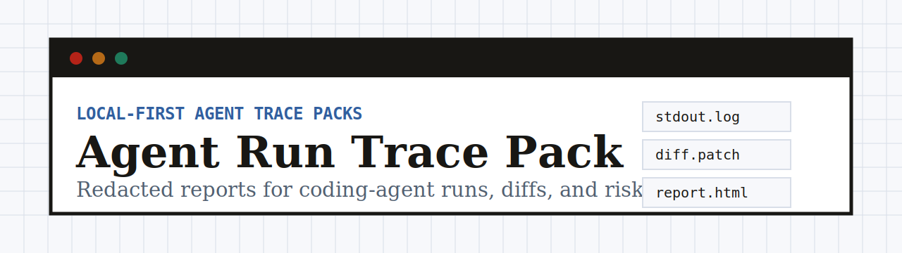
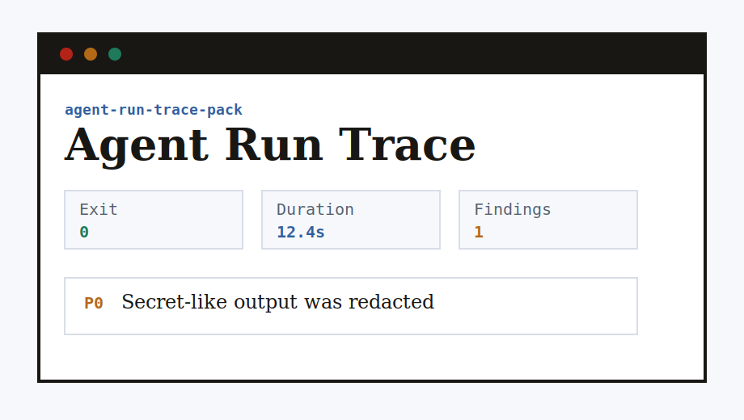

# Agent Run Trace Pack

Record local coding-agent runs into redacted, reviewable trace packs.

[](docs/release-readiness.md)
[](https://github.com/aolingge/agent-run-trace-pack/actions/workflows/ci.yml)
[](LICENSE)
[](package.json)

Agent Run Trace Pack is a local-first CLI for maintainers and teams using Codex, Claude Code, Cursor, Gemini CLI, OpenCode, Goose, GitHub Copilot coding workflows, or MCP-based tooling. It wraps a command, records what happened, redacts sensitive output, captures git state, and writes a shareable report.

## Quick Start

- Source: <https://github.com/aolingge/agent-run-trace-pack>
- npm: <https://www.npmjs.com/package/agent-run-trace-pack>
- Docs: <https://aolingge.github.io/agent-run-trace-pack/>

```bash
npx agent-run-trace-pack run -- npm test
```

Run from source when contributing:

```bash
npm install
npm run build
node dist/cli.js run -- npm test
```

## Docs

- [Quick start](#quick-start)
- [Safe command examples](docs/examples.md)
- [Safety model](#safety-model)
- [Report preview](#report-preview)
- [Release readiness](docs/release-readiness.md)
- [Maintainer launch kit](docs/launch-kit.md)

## Package Contract

Current package metadata targets Node `>=20` and exposes `agent-run-trace-pack` and `artrace`.

The package preview is limited to the npm `files` allowlist: `dist`, `docs`, `assets`, `README.md`, and `LICENSE`, plus npm's required package metadata. `docs/release-readiness.md` records the exact local checks used to verify that preview.

The trace pack writes:

- `.agent-traces/<trace-id>/manifest.json`
- `.agent-traces/<trace-id>/stdout.log`
- `.agent-traces/<trace-id>/stderr.log`
- `.agent-traces/<trace-id>/diff.patch`
- `.agent-traces/<trace-id>/report.md`
- `.agent-traces/<trace-id>/report.html`

The JSON report is `manifest.json`; no separate `report.json` file is written in v0.1.

## Why It Exists

Coding agents increasingly read files, run commands, call tools, and edit repositories. When a run succeeds, fails, leaks a token-like value, or changes more than expected, maintainers need a compact local record that explains the command, output, diff, exit status, and risk signals without uploading source code.

## CLI

```bash
agent-run-trace-pack run [--out .agent-traces] [--cwd path] -- <command...>
agent-run-trace-pack summarize <trace-dir>
agent-run-trace-pack doctor
agent-run-trace-pack init
```

Examples:

```bash
artrace run -- npm test
artrace run --out .tmp/traces -- codex --help
artrace run -- gemini --help
artrace summarize .agent-traces/2026-04-28T10-00-00-000Z
```

More examples are in [docs/examples.md](docs/examples.md), including synthetic Codex, Claude Code, Gemini CLI, OpenCode, and Goose-style commands.

## What It Captures

| Surface | What gets recorded |
| --- | --- |
| Command | Wrapped command, working directory, start/end time, duration, exit code |
| Output | Redacted stdout and stderr logs |
| Git state | HEAD, branch, status, diff stat, and patch after the run |
| Risk signals | Destructive commands, pipe-to-shell, publish/release commands, permission failures, secret-like output |
| Reports | JSON manifest, Markdown report, and HTML report |

## Safety Model

- Local-first: no telemetry, hosted API, model call, or cloud upload.
- Redacted output: token-like values are removed from saved logs and reports.
- Review before sharing: trace packs can still reveal file names, command names, and project structure.
- No replay by default: the tool records a run; it does not automatically rerun or approve commands.

## Report Preview



## Development

```bash
npm install
npm run check
npm run smoke
node scripts/release-dry-run.mjs
```

Repository layout:

```text
src/
  cli.ts
  core/
  report/
tests/
docs/
assets/
```

## Roadmap

- v0.1: CLI trace packs, redaction, git diff capture, Markdown/HTML/JSON reports.
- v0.2: GitHub Action wrapper and PR artifact upload examples.
- v0.3: MCP gateway policy recording and tool-call schema snapshots.
- v0.4: multi-agent eval runs across Codex, Gemini CLI, OpenCode, Claude Code, and Goose.

## Security

Do not share trace packs that contain private source details, private URLs, raw logs, cookies, browser profiles, or real credentials. Redaction is a safety net, not a guarantee.

## Contributing

Small, well-tested contributions are welcome. Start with [CONTRIBUTING.md](CONTRIBUTING.md), run `npm run check`, and include a synthetic trace fixture when changing detection behavior.

## License

MIT
